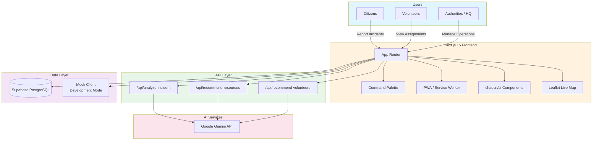

# ResQNet AI

ResQNet AI is an enterprise-grade AI-Powered Disaster Response & Resource Coordination Platform. Built on Next.js 16 (Turbopack), TypeScript, and a modern, high-contrast, light-themed design system utilizing Slate Gray, Deep Slate Blue, and Accessible Royal Blue colors.

---

## 🛠️ Tech Stack & Foundation

- **Framework**: [Next.js 15](https://nextjs.org/) (App Router)
- **Language**: [TypeScript](https://www.typescript.org/)
- **Styling**: [TailwindCSS v4](https://tailwindcss.com/) (Vanilla CSS Variables)
- **UI Components**: [shadcn/ui](https://ui.shadcn.com/) (with Radix / Base UI Primitives)
- **Animations**: [Framer Motion](https://www.framer.com/motion/)
- **Icons**: [Lucide Icons](https://lucide.dev/)
- **Forms & Validation**: [React Hook Form](https://react-hook-form.com/) & [Zod](https://zod.dev/)
- **Formatting & Linting**: [Prettier](https://prettier.io/) & [ESLint](https://eslint.org/)

---

## 📁 Enterprise Architecture & Directory Structure

The project conforms to a modular enterprise folder layout, optimizing separation of concerns and features:

```text
ResQNet AI/
├── app/               # Next.js pages, routing layouts, and default entry page
├── components/        # Reusable UI component layer
│   ├── layout/        # Global layout shells (Navbar, Footer, Sidebar, DashboardLayout)
│   └── ui/            # shadcn/ui foundation components (Buttons, Badges, Tables, Modals, Breadcrumbs, Toasters)
├── features/          # Domain-driven feature modules (Incidents, Resources, Deployments)
├── hooks/             # Custom global React hooks (useTheme, etc.)
├── lib/               # Shared utility logic (utils, API clients, HMAC signers)
├── types/             # Project-wide TS interfaces
├── styles/            # Styling declarations (globals.css containing design tokens)
├── public/            # Static assets and media files
├── tsconfig.json      # TypeScript absolute imports configurations
├── components.json    # shadcn settings and directories mappings
└── .env.example       # Local development template variables
```

---

## 🎨 Design System Specifications

| Element        | Reference Color                | Purpose                                                                |
| :------------- | :----------------------------- | :--------------------------------------------------------------------- |
| **Primary**    | `#2563EB` (Royal Blue)         | Call-to-actions, active indicators, primary highlight links.          |
| **Text**       | `#0F172A` (Deep Slate Blue)    | High contrast text, card headers, form labels, and bold content.       |
| **Secondary**  | `#475569` (Slate Gray)         | Secondary text descriptions, navigation controls, and secondary buttons.|
| **Border**     | `#E2E8F0` / `#CBD5E1` (Slate)  | Clean layout lines, card frames, and input field outlines.              |
| **Background** | `#F8FAFC` (Light Slate Background)| Calm operations center background.                                     |
| **Typography** | `Inter`                        | Sans-serif standard font.                                              |

This platform enforces a clean, calm, light-mode-first operations dashboard designed for high readability, visual accessibility (WCAG AA compliance), and professional administrative control.

---

## 🚀 Running Locally

1. **Install Dependencies**:
   ```bash
   npm install
   ```
2. **Start Dev Server**:
   ```bash
   npm run dev
   ```
3. **Format Code**:
   ```bash
   npx prettier --write .
   ```
4. **Lint Project**:
   ```bash
   npm run lint
   ```
5. **Build for Production**:
   ```bash
   npm run build
   ```

---

## 🏗️ System Architecture



### Architecture Overview

- **Citizens** report incidents and track status through the public dashboard
- **Volunteers** receive assignments and update their availability
- **Authorities** manage resources, dispatch teams, and analyze incidents via AI
- **Gemini API** powers intelligent incident analysis, resource recommendations, and volunteer matching
- **Supabase** provides PostgreSQL database, authentication, and real-time subscriptions
- **Mock Client** enables offline development without external dependencies

---

## 📋 Quick Setup

### Prerequisites

- Node.js 18+
- npm or yarn

### Environment Configuration

Create a `.env.local` file:

```env
NEXT_PUBLIC_SUPABASE_URL=https://your-project.supabase.co
NEXT_PUBLIC_SUPABASE_ANON_KEY=your-anon-key
GEMINI_API_KEY=your-gemini-api-key
```

For development without external services, the app automatically falls back to mock data.

### Mock Login Credentials

| Role      | Email                  | Password   |
| --------- | ---------------------- | ---------- |
| Citizen   | `citizen@resqnet.ai`   | `password` |
| Volunteer | `volunteer@resqnet.ai` | `password` |
| Authority | `authority@resqnet.ai` | `password` |

---

## 🧩 Features

- **Global Command Palette** — Press `Ctrl+K` or `Cmd+K` to search incidents, resources, volunteers, and navigate.
- **PWA Support** — Offline-capable with service worker caching.
- **Role-Based Dashboards** — Tailored views for Citizens, Volunteers, and Authorities.
- **Live Incident Map** — Real-time geographic visualization with Leaflet and heatmaps.
- **AI-Powered Analysis** — Gemini API for incident prioritization and resource recommendations.
- **Resource Allocation** — Track inventory, allocations, and history.
- **Volunteer Coordination** — Proximity-based dispatch and assignment tracking.
- **Shelters Directory** — Track shelters capacity, occupants, and coordinates.
- **Light Theme Defaults** — Flat, minimal UI designed for high contrast and visual accessibility.

---

## 📄 Documentation

- [Deployment Guide](DEPLOYMENT.md) — Vercel, Supabase, and Gemini API setup
- [Contributing Guide](CONTRIBUTING.md) — Development workflow and coding standards
- [License](LICENSE) — MIT License

---

## 📸 Screenshots

> Screenshots will be added here after deployment. Placeholder sections for key views:

| View                       | Description                                                                          |
| -------------------------- | ------------------------------------------------------------------------------------ |
| **Dashboard**              | Role-based overview with incident counts, resource status, and volunteer assignments |
| **Incident Map**           | Live geographic visualization with incident markers and heatmap layers               |
| **Command Palette**        | Global `Ctrl+K` / `Cmd+K` search overlay for incidents, resources, and navigation    |
| **Resource Management**    | Inventory tracking, allocation history, and warehouse stock levels                   |
| **Volunteer Coordination** | Proximity-based dispatch, assignment tracking, and availability status               |
| **AI Analysis**            | Gemini-powered incident prioritization and resource recommendations                  |

---

## 🤝 Contributing

We welcome contributions! Please read our [Contributing Guide](CONTRIBUTING.md) for details on our code of conduct, development workflow, and pull request process.

---

## 📜 License

This project is licensed under the Apache License 2.0 — see the [LICENSE](LICENSE) file for details.
